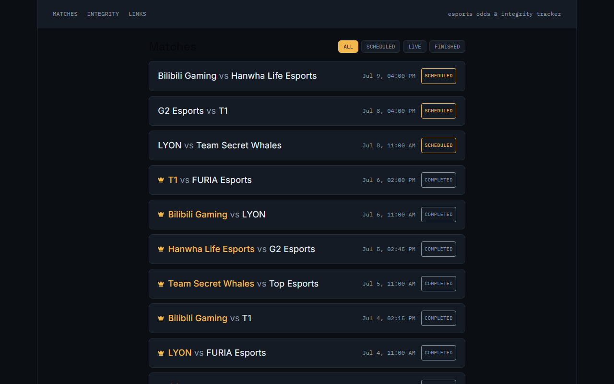
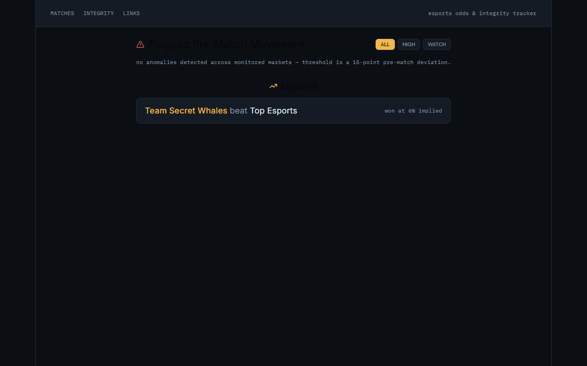
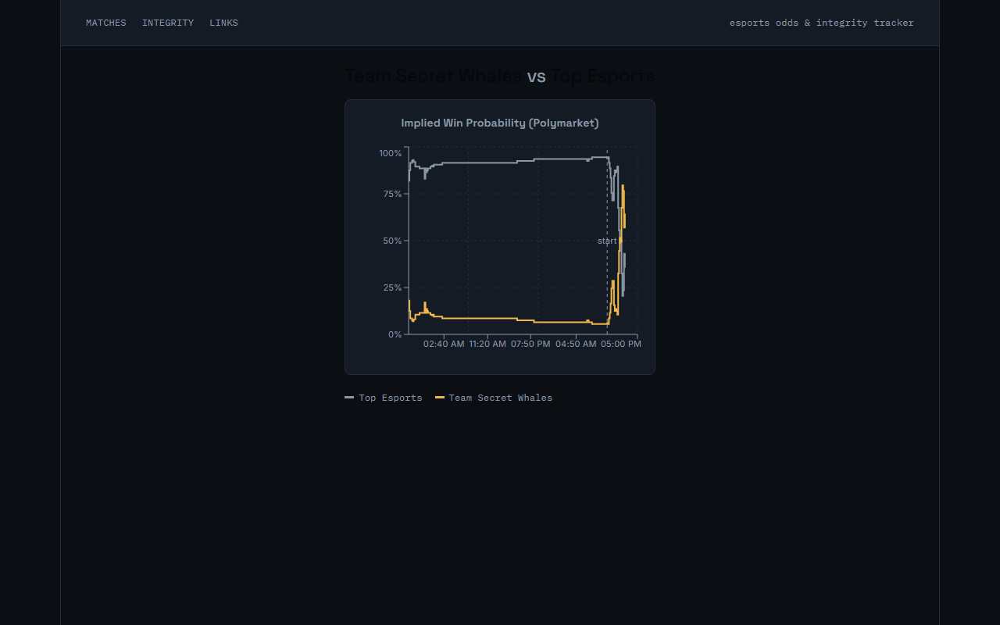

# Esports Integrity Tracker

A match tracker for competitive League of Legends that overlays prediction-market
odds on top of match data and flags integrity red flags: sudden pre-match price
swings and underdog upsets. Built in six days as an ASP.NET Core + PostgreSQL API
with a React dashboard, syncing live match data from PandaScore and win-probability
history from Polymarket.

**Live demo:** not deployed yet — see [Roadmap](#roadmap).

## Screenshots

**Match list** — synced from PandaScore, filterable by status.



**Integrity dashboard** — pre-match odds swings and upsets, filterable by severity.
The example below is real: Team Secret Whales were priced at a 6% implied win
probability against Top Esports and won anyway.



**Match detail** — implied win probability over time, sourced from Polymarket's
CLOB price history, with the game-start marker overlaid.



## Why I built this

I've always been invested in Esports, and wanting to learn a new languag (.NET) while also learning claude code I decided to make something that I'd find useful, which is a website that'd let me look up the results of esports matches easily and let me know if there's an upset and if there is an upset if there's a weird movement in public betting sites (mainly polymarket because I've been hearing about it so much).

## Tech stack

- **API:** ASP.NET Core (.NET 10), EF Core + Npgsql
- **Database:** PostgreSQL
- **Frontend:** React 19 + TypeScript (Vite), Recharts, React Router
- **Data sources:** [PandaScore](https://pandascore.co) (match/team data), [Polymarket](https://polymarket.com) (prediction-market odds history)
- **Testing:** xUnit + `WebApplicationFactory` (API, integration), Vitest + Testing Library (frontend)
- **CI:** GitHub Actions — API tests run against a real Postgres service container; frontend is linted, tested, and built
- **Containers:** Docker Compose (Postgres + API + nginx-served static frontend)

## How it works

A background service polls PandaScore every 15 minutes for match/team data, and
separately polls Polymarket for price history on any match that's been linked to
a market via `POST /api/marketlinks`. Two detectors run over that price history:

- **Anomaly detection** — flags any pre-match price deviation from the opening
  price beyond a configurable threshold (default 15 points).
- **Upset detection** — flags completed matches where the winner's last pre-match
  price implied under 50% win probability.

## Running locally

The whole stack (Postgres + API + frontend) runs via Docker Compose.

1. Copy `.env.example`-style config: create a `.env` file in the repo root with
   a [PandaScore API key](https://pandascore.co/settings/tokens):
   ```
   PANDASCORE_API_KEY=your-key-here
   ```
2. Start everything:
   ```bash
   docker compose up --build
   ```
3. Frontend: http://localhost:3000 · API: http://localhost:5150

Match data appears after the first PandaScore sync (runs immediately on API
startup). Odds only show up for matches you've linked to a Polymarket market —
use the **LINKS** page in the nav (`/admin/links`) to link a match to a market
by its Polymarket slug (the last segment of the market's URL).

### Running the API/frontend separately (without Docker)

```bash
# Postgres
docker run --name esports-postgres -e POSTGRES_PASSWORD=mypassword -e POSTGRES_DB=esports_tracker -p 1234:5432 -d postgres

# API
cd EsportsTracker.Api
dotnet ef database update
dotnet run

# Frontend
cd web
npm install
npm run dev
```

### Tests

```bash
# API — unit tests + WebApplicationFactory integration tests
# (needs a reachable Postgres; see .github/workflows/ci.yml for the exact setup)
dotnet test

# Frontend
cd web
npm test
```

## Roadmap

- Deploy to a free-tier host (Railway/Render/Azure) and link the live URL here.
- Rate-bound anomaly detection (shift over X% within a rolling time window, not
  just total deviation from the opening price).
